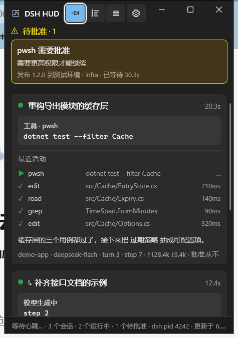
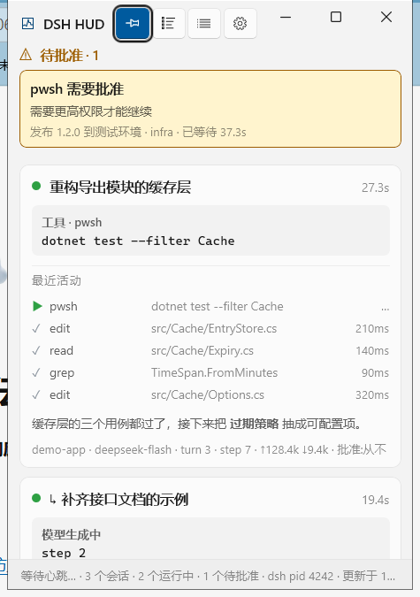
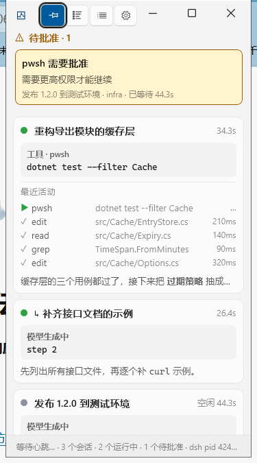
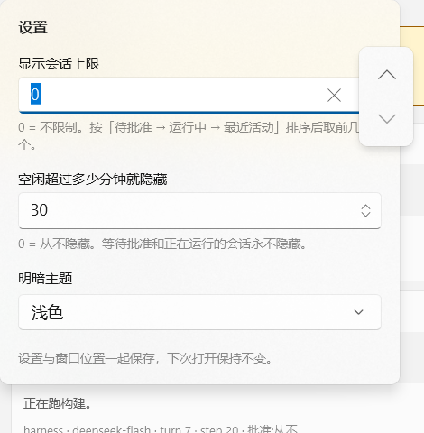
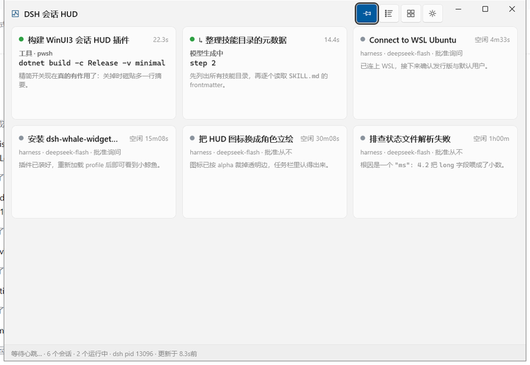
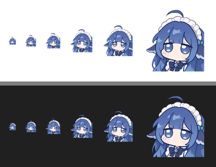

# dsh-session-hud

[](https://github.com/xieani090612/dsh-session-hud/actions/workflows/ci.yml)
[](LICENSE)
[](#环境要求)

**DSH 会话 HUD** —— 把 DeepSeek Harness 里正在运行的会话「现在在做什么」和「有没有待批准的提示」，
实时显示在一个独立的 **WinUI 3** 悬浮窗里。窗口可以随意拖动、拉伸缩放、置顶，
跟随系统浅色/深色主题，界面还会随窗口大小自适应。

| 深色 | 浅色 | 窄窗口 |
| --- | --- | --- |
|  |  |  |

```
┌─ DSH 会话 HUD ──────────────  [置顶][精简][视图][设置] ─ ─ □ ✕ ┐
│ ⚠ 待批准 · 1                                                 │
│ ┌──────────────────────────────────────────────────────────┐ │
│ │ pwsh 需要批准                                            │ │
│ │ 需要以更高权限运行 PowerShell 命令                        │ │
│ │ 构建 WinUI3 会话 HUD 插件 · harness · 已等待 24.5s        │ │
│ └──────────────────────────────────────────────────────────┘ │
│ ● 构建 WinUI3 会话 HUD 插件                        等待 24.5s │
│   ┌──────────────────────────────────────────────────────┐   │
│   │ 等待批准                                              │   │
│   │ pwsh 已挂起，等待人工决定                              │   │
│   └──────────────────────────────────────────────────────┘   │
│   最近活动                                                    │
│   ▶ pwsh   dotnet build -c Release                       …   │
│   ✓ edit   app/DshSessionHud.csproj                  210ms   │
│   ✓ read   MrtCore.PriGen.targets                    140ms   │
│   ✕ pwsh   netstat -ano | Select-String ':19387'      1.5s   │
│   构建成功了。现在检查输出目录里有没有 resources.pri …         │
│   harness · deepseek-flash · turn 3 · step 7 · ↑128.4k ↓9.4k │
│                                                              │
│ ● ↳ 整理技能目录的元数据                              模型生成中│
│   ┌──────────────────────────────────────────────────────┐   │
│   │ 模型生成中                                            │   │
│   │ step 2                                                │   │
│   └──────────────────────────────────────────────────────┘   │
├──────────────────────────────────────────────────────────────┤
│ 2 个会话 · 2 个运行中 · 1 个待批准 · dsh pid 4242 · 更新于 0.4s│
└──────────────────────────────────────────────────────────────┘
```

> [!NOTE]
> **图标不在 MIT 覆盖范围内。** 默认图标是从一张立绘生成的，代码按 MIT 授权但这张图不适用
> —— 详见 [`PROVENANCE.md`](PROVENANCE.md)。如果你要再分发这个包，请先确认该图的权利状态，
> 或换成你自己拥有权利的图：替换 `assets/icon-source.webp`，再跑一次
> `python assets/make-icon.py` 即可（脚本会重新生成 `app/app.ico` 与 README 用的预览图）。

---

## 目录

- [它解决什么](#它解决什么) · [环境要求](#环境要求) · [安装](#安装) · [怎么把窗口叫出来](#怎么把窗口叫出来)
- [数据来源（全部只读）](#数据来源全部只读) · [窗口交互](#窗口交互) · [设置](#设置)
- [视图模式：列表 / 格子](#视图模式列表--格子) · [Markdown 渲染](#markdown-渲染) · [应用图标](#应用图标)
- [随窗口大小自适应](#随窗口大小自适应) · [插件配置](#插件配置)
- [测试](#测试) · [打包与发布](#打包与发布) · [排查](#排查) · [已知限制](#已知限制)
- [参与开发](CONTRIBUTING.md) · [安全说明](SECURITY.md) · [素材来源](PROVENANCE.md) · [更新日志](CHANGELOG.md)

---

## 它解决什么

DSH 跑长任务时，你通常切到别的窗口去了。等到回来看，要么它早就在等你批准一个工具调用，
要么你根本不知道现在卡在哪一步。

这个插件把状态**钉在屏幕角落**：谁在跑、正在用什么工具、已经多久、有没有等你批准。
一个独立的原生小窗，不是嵌在网页里的面板 —— 所以你能把它拖到副屏、缩到只剩一条、
置顶在编辑器上方，而且它跟随系统的明暗主题。

---

## 环境要求

| | 要求 |
| --- | --- |
| 系统 | Windows 10 1809（build 17763）或更高 |
| DSH | 带插件系统的版本（bundle 机制 + `dsh.client` 客户端模块） |
| 使用者 | **不需要装任何东西** —— `dist/` 是 self-contained，不依赖 .NET 运行时，也不依赖 Windows App Runtime |
| 开发者 | .NET 8 SDK（构建窗口）+ Node.js 20（跑测试）；**不需要 Visual Studio** |

> Windows 之外：插件的宿主半能加载，但窗口是 WinUI 3 程序，所以不会有任何窗口出现。

---

## 组成

| 部分 | 位置 | 作用 |
| --- | --- | --- |
| 宿主插件 | `lib/index.js` | 跑在 DSH 进程里，**只读**观察会话状态，原子写出一份快照 JSON，并负责拉起窗口 |
| 悬浮窗 | `app/` | WinUI 3（C# / .NET 8）桌面程序，读快照并渲染；负责缩放、拖动、置顶、明暗主题 |

两者通过**状态文件**通信：`%USERPROFILE%\.dsh\session-hud\state.json`
（若设置了 `DSH_HOME` 则为 `$DSH_HOME\session-hud\state.json`）。

### 为什么用状态文件而不是 HTTP

DSH 的 webServer 有信任栅栏：非回环 Host、未认证请求一律拒绝（对 `http://127.0.0.1:<port>/`
裸请求会返回 401）。插件虽然能注册路由，但外部原生进程还要自己解决鉴权与端口发现。
状态文件零鉴权、零端口、同用户可读，而且天然支持「窗口比宿主后启动」「宿主重启后窗口自动接上」
这两种顺序，所以选它做主通道。

写入采用 **临时文件 + rename** 的原子替换，窗口永远读不到半截 JSON。

---

## 安装

这是一个标准的 DSH bundle 包：`package.json` 里的 `dsh.bundle.patch` 指向 `cordis.patch.yml`，
由它把宿主插件插进配置树；`dsh.client` 声明浏览器半（侧边栏那个按钮）。

### 桌面版（图形界面）

1. **拿到包**：从 [Releases](https://github.com/xieani090612/dsh-session-hud/releases)
   下载 `dsh-session-hud-<版本>-install.zip`（约 65 MB）。
   也可以克隆仓库后自己打一个，见[打包与发布](#打包与发布)。
2. **解压到一个固定位置**。装好之后这个文件夹要一直留着 —— 插件是按路径链接进来的，
   挪走或删掉就失效了。
3. 在解压出来的文件夹里运行：

   ```powershell
   .\install.ps1
   ```

   它会确认 `dist\DshSessionHud.exe` 在、往 profile 里声明依赖与 bundle、跑一次依赖安装，
   并在改动之前把 profile 的 `package.json` 备份成 `package.json.bak`。
   详细中文说明见压缩包里的 `INSTALL.txt`。

4. **重启 DSH**。插件模块路径变了之后必须重启才会加载新包（管理器会提示 `restart-required`）。

不想跑脚本的话，就打开 DSH 的**插件管理器**添加一个包，
填**解压出来的那个文件夹的绝对路径**（前面加 `link:`）：

```
link:C:\你解压到的地方\dsh-session-hud-1.1.0
```

> `release.ps1` 另外还会产出 `dsh-session-hud-<版本>.tgz` —— 那个是给
> 「插件管理器 / pnpm 直接装包」用的（依赖写 `file:<tgz 路径>`），不是给手工解压用的。
> 两种形式的区别见[打包与发布](#打包与发布)。

> 装好之后你会同时得到：随 DSH 启动自动打开的悬浮窗、侧边栏底部的打开按钮、以及 `/hud` 命令。

### 命令行 / 手动

如果这个 DSH 安装带命令行：

```powershell
# ① 装打包好的 tgz（使用者）
dsh plugin --profile <profile> add file:C:\path\to\dsh-session-hud-1.1.0.tgz

# ② 装目录（等价，pnpm 会拷一份进 profile）
dsh plugin --profile <profile> add C:\path\to\dsh-session-hud

# ③ 本地开发用 link，改代码不用重装（但插件代码要重启 DSH 才生效）
dsh plugin --profile <profile> add link:C:\path\to\dsh-session-hud
```

没有命令行时，直接改 profile 的 `package.json` 也可以（和 `dsh-whale-widget` 的做法一致），
改完在 profile 目录跑一次 `pnpm install`，再重启 DSH：

```json
{
  "dependencies": {
    "dsh-session-hud": "file:C:/path/to/dsh-session-hud-1.1.0.tgz"
  },
  "dsh": {
    "profile": {
      "bundles": ["@deepseek-ai/dsh-base", "@deepseek-ai/dsh-web-app", "dsh-session-hud"]
    }
  }
}
```

或者直接跑仓库里的脚本（会构建 `dist/`、写 profile、跑 pnpm，并提示重启）：

```powershell
.\install.ps1 -Profile desktop
```

插件加载后会自动拉起窗口（窗口自带单实例互斥体，重复拉起只会把已有窗口叫到前台）。

### 包结构

`pnpm pack`（或 `npm pack`）按 `package.json` 的 `files` 打包，产物是一个 `.tgz`：

```
dsh-session-hud-1.1.0.tgz        ~65 MB
└── package/
    ├── package.json             ← dsh.bundle.patch + dsh.client（platform/immediately/inject）
    ├── cordis.patch.yml         ← bundle 挂载声明
    ├── lib/
    │   ├── index.js             ← 宿主半（观察会话 + 写快照 + 路由）
    │   └── client.js            ← 浏览器半（侧边栏那个按钮）
    ├── dist/                    ← 预编译的 HUD（self-contained，约 167 MB 解包后）
    │   ├── DshSessionHud.exe
    │   ├── app.ico
    │   └── …（.NET 运行时 + Windows App SDK）
    ├── docs/                    ← README 用的截图（不随包发就会在 npm 上显示成裂图）
    ├── README.md / CHANGELOG.md / PROVENANCE.md / LICENSE
    └── （app/ 源码、assets/、test/ 都不进包）
```

**`dist/` 是随包发布的正式位置**：`lib/index.js` 按 `dist/ → app/bin/Release/…/publish →
app/bin/Release/… → app/bin/Debug/…` 的顺序找 exe，所以同一个包在「装好的包」和
「本地开发目录」里都能跑起来。

> 体积说明：`dist/` 是 **self-contained** 发布，带了完整的 .NET + Windows App SDK 运行时
> （约 167 MB 解包 / 约 65 MB 压缩）。换来的是**目标机器不需要预装 .NET，也不需要
> Windows App Runtime，更不需要 MSIX 注册** —— 拷过去就能跑。
> 如果你要的是小体积，可以不发布 `dist/`、改为在目标机器上跑一次 `build.ps1 -Pack`。

### 构建窗口

```powershell
.\build.ps1              # Release 构建（开发用）
.\build.ps1 -Pack        # 发布到仓库根的 dist\（随包发布的正式位置）
.\build.ps1 -Clean       # 清 bin/obj/dist
```

开发构建产物：`app\bin\Release\net8.0-windows10.0.19041.0\win-x64\DshSessionHud.exe`
打包产物：`dist\DshSessionHud.exe`

完整的发布流程：

```powershell
.\build.ps1 -Pack
node "$env:USERPROFILE\.dsh\dsh-runtimes\dsh-primary-runtime\dependencies\pnpm\bin\pnpm.mjs" pack
```

> **没有 Visual Studio 也能构建。** 关键在 `EnableMsixTooling=true`：这个开关同时决定用哪套
> PRI 工具链。设为 `false` 会回落到 `MrtCore.PriGen.targets`，它依赖只有 Visual Studio 才带的
> `Microsoft.Build.Packaging.Pri.Tasks.dll`，在纯 .NET SDK 环境下必定报
> `MSB4062: 未能加载任务 ExpandPriContent`。设为 `true` 则改用 WindowsAppSDK 自带、
> 随 NuGet 包发布的独立工具链（`Microsoft.Build.Msix.dll`）。打包本身由
> `WindowsPackageType=None` 关掉。
>
> 另外 Windows App SDK 采用 **self-contained** 模式，所以目标机器不需要预装
> Windows App Runtime，也不需要 MSIX 注册；整个目录拷过去就能跑。

---

## 怎么把窗口叫出来

三种方式，覆盖「一开始就有」到「手滑关掉了」：

| 方式 | 说明 |
| --- | --- |
| **随 DSH 启动自动打开** | 插件加载后立即拉起窗口（`cordis.patch.yml` 的 `autoLaunch: true`）。DSH 一起来，HUD 就在。 |
| **侧边栏按钮** | DSH 网页侧边栏底部、设置按钮旁边的那个小窗口图标（见下）。 |
| **`/hud` 命令** | 在会话里敲 `/hud`。 |

三者都是同一个动作：拉起窗口，或者**把已经在跑的窗口前置**（窗口自带单实例互斥体，
所以不会开出第二个）。窗口被关掉之后，后两种方式都能把它叫回来，不必重启 DSH。

### 侧边栏按钮


宿主半是「纯 host」的，但很多用户不开窗口就不知道窗口在哪 —— 所以在网页上加了个按钮。
它走 DSH 的客户端模块机制（`package.json` 的 `dsh.client` + `exports["./client"]`），
注册进 `sidebar.footer.action` 槽：

```js
// lib/client.js 的核心
ctx.slots.inject('sidebar.footer.action', () => ctx.slots.register({
  name: 'sidebar.footer.action', id: 'dsh-session-hud-open', order: 10, label: '打开会话 HUD',
}, OpenHudButton))
```

几个刻意的选择：

- **走槽位，不碰 DOM。** 注册进官方给的座位，不猜别的插件的 DOM 结构，也不改 app root。
- **样式只用宿主主题 token**（`--dsw-alias-bg-layer-2` / `--dsw-alias-label-secondary` /
  `--dsw-alias-state-success-primary` 等），所以自动跟随明暗主题；颜色一个都没写死。
- **用 `inject` 等槽位声明**，而不是假设它已经在。槽位还没声明时会等，插件卸载时自动摘掉。
- **点击只打一个同源 POST 路由**（`/dsh-session-hud/open`），宿主半收到后拉起窗口，
  并把 `{ ok, launched, exe }` 返回给按钮；按钮据此短暂显示成功/失败态。

这条路由会**启动一个进程**，所以宿主半给它加了信任栅栏：只接受回环 Host
（逐段校验，`127.0.0.1.evil.com` 这类相似域名不算）、拒绝 `Sec-Fetch-Site: cross-site`、
带 `Origin` 时必须同源、非 POST 一律 405；宿主自带栅栏可用时再委托它，且**它抛异常按拒绝处理**。

> 为什么客户端不走 `host.call`：那套是「动态客户端半」的受限面（只有
> `ctx`/`React`/`host`/`styles`/`console`，连 `fetch` 都没有）。静态客户端模块是正常浏览器环境，
> 所以宿主开一个路由、客户端 `fetch` 一下，两端各自都更直白。

---

## 数据来源（全部只读）

| DSH 事件 / 服务 | 用到的信息 |
| --- | --- |
| `session/event` | `turn/start` `step/start` `tool/call` `tool/result` `assistant/message` `user/message` `turn/end` |
| `agent/status` | 会话运行 / 空闲 |
| `approval/request` | 批准提示（waterfall，观察后原样 `next()`） |
| `user-questions/request` | `ask_user_question` 提示（同上） |
| `session/created` / `session/disposed` | 会话生命周期 |
| `ctx.sessions` / `ctx.sessionTitle` | 冷启动枚举、会话标题 |

**不改变 DSH 的任何行为。** 尤其是 `approval/request` 是 waterfall：插件只观察，
并且**总是**把决定权交回给 DSH 自己的 answerer 链；任何观察异常都被吞掉，
不会吞掉或改写批准结果。其他回调也全部包了 try/catch —— 插件出问题绝不能连累 DSH。

---

## 窗口交互

| 操作 | 说明 |
| --- | --- |
| 拖动 | 拖标题栏任意空白处 |
| 缩放 | 拖窗口边缘/角；最小 300×200 DIP |
| 置顶 | 标题栏第一个开关 |
| 精简 | 列表折叠「最近活动」；格子模式下控制磁贴高度与那行摘要 |
| 视图 | 列表 / 格子两种模式切换（见下） |
| 设置 | 打开设置面板：显示会话上限、空闲隐藏、明暗主题（见下） |
| 位置记忆 | 关闭时把位置/大小/开关/视图/设置写入 `%LOCALAPPDATA%\DshSessionHud\window.json` |
| 重新打开 | 窗口被关掉后，在 DSH 里执行 `/hud` 命令叫回来（单实例互斥体保证不会开出第二个） |

### 命令行参数

```
DshSessionHud.exe [--state <path>] [--stale-seconds <n>] [--exit-after-stale <n>]
```

- `--state`：状态文件路径（默认 `%USERPROFILE%\.dsh\session-hud\state.json`，可用 `DSH_HUD_STATE` 覆盖）
- `--stale-seconds`：多久没有新快照就提示断开（默认 15）
- `--exit-after-stale`：断开多久后自动关闭；插件拉起时传 `90`。

---

## 设置

标题栏最右边的齿轮按钮打开设置面板，改完立刻生效，并随窗口一起保存。



| 设置 | 默认 | 说明 |
| --- | --- | --- |
| 显示会话上限 | `0`（不限制） | 最多显示几个会话；按「待批准 → 运行中 → 最近活动」排序后取前几个 |
| 空闲超过多少分钟就隐藏 | `0`（从不） | 空闲超过 N 分钟的会话隐藏；`0` = 从不 |
| 明暗主题 | 跟随系统 | 跟随系统 / 浅色 / 深色；跟随系统时会实时响应系统切换 |

### 两条过滤规则都有「永不隐藏」的保护

- **等待批准的会话永不隐藏**，也不受会话上限之外的特殊照顾影响 ——
  它本来就在排序最前面，所以上限永远先保住它。
- **正在运行的会话永不因空闲被隐藏**（它也不算空闲）。

理由一样：HUD 上最不该被静默藏掉的就是「谁在等我批准」。被过滤掉多少会在状态栏写明
（`… · 已隐藏 3 · …`），不会让人以为是数据丢了。

> 会话上限**不依赖快照自己的顺序**：`HudViewModel` 会自己再排一次序再取前 N 个。
> 插件写快照时本来就按这个顺序排，所以生产环境下这次排序是空操作；
> 但自己排过之后，来源顺序一变也不会把等批准的会话切掉（这是实测到的：
> 手工构造的快照顺序一变，「上限 3」就把待批准那条挤出去了）。

### 主题为什么挪进了设置面板

标题栏再加第五个按键，标准档下标题那一列就只剩 20 来个 DIP，标题会被截成省略号。
主题本来就是「偶尔改一次」的设置，不是需要随手点的开关，所以收进面板；
标题栏保持四个按键。

---

## 视图模式：列表 / 格子

标题栏第三个按钮切换。会话多的时候格子模式一屏能看全，会话少的时候列表模式信息更全。

| 列表 | 格子 |
| --- | --- |
|  |  |

- **列表**：一行一张详细卡片 —— 标题、当前工作、最近活动时间线、上一条输出、元信息。
- **格子**：等宽磁贴平铺，每张是「谁 · 在干什么 · 多久了」，再带一行上一条输出的摘要。
  空闲的磁贴用工作区 / 模型 / 批准策略补位，不会空着。

### 「精简」在两个模式下都有可见效果

| | 列表 | 格子 |
| --- | --- | --- |
| 精简 **关**（默认） | 显示「最近活动」时间线 | 磁贴带一行上一条输出摘要，磁贴更高 |
| 精简 **开** | 折叠时间线 | 只留标题与当前工作，磁贴变矮、一屏放更多 |

格子模式下精简开关**会同时改磁贴内容和最小高度**（标准档 134 → 88 DIP），所以一按就能看出差别。

> 这里踩过一次：最初格子模式下的精简只让「当前工作」从 2 行变 1 行 —— 文本短的时候
> 完全看不出区别，用起来就像「格子模式强制精简、而且关不掉」。现在改成控制「有没有那一行摘要 +
> 磁贴多高」，两个状态一眼就能区分。

### 列数不用自己算

用 `ItemsRepeater` + `UniformGridLayout`：它按可用宽度决定一行放几个
（每张不小于 `MinItemWidth`），再把一行铺满。宽度变化时自动重排，不需要监听尺寸去算列数。

选 `ItemsRepeater` 而不是 `ItemsControl` 的原因很实际：**`Layout` 和 `ItemTemplate` 都是普通属性**，
而 `ItemsControl` 的排布藏在 `ItemsPanelTemplate` 内部 —— 模板里的元素既拿不到 `DataContext`
（绑定不了列数），也没法从代码里换掉。`ItemsRepeater` 这两个属性可以直接赋值：

```csharp
SessionsRepeater.Layout = _gridMode ? _gridLayout : _listLayout;
SessionsRepeater.ItemTemplate = _gridMode ? _gridTemplate : _listTemplate;
```

磁贴的最小尺寸随尺寸分层变化（宽 × 高，非精简 / 精简）：
窄 `190×118 / 190×78`、标准 `212×134 / 212×88`、宽 `244×158 / 244×100`。
所以在任何窗口宽度下列数都合理，精简开关也会立刻改变一屏能放几张。

---

## Markdown 渲染

卡片底部那行「上一条模型输出」按 Markdown 渲染。模型经常输出 `**重点**`、`` `命令` ``、
`[链接](url)`，不处理的话这些标记会**原样**显示出来——之前截图里就能看到
「renders **Normal** (title visible...)」这种裸标记。

| 语法 | 效果 |
| --- | --- |
| `**粗**` / `__粗__` | **加粗** |
| `*斜*` / `_斜_` | *斜体* |
| `***粗斜***` | 又粗又斜 |
| `` `代码` `` | 等宽字体 |
| `~~删除~~` | ~~删除线~~ |
| `[文字](https://…)` | 可点击链接，点开用系统默认浏览器（只认 `http`/`https`/`mailto`） |
| `\*转义\*` | 显示为字面量 `*转义*` |
| `# 标题` / `- 列表` / `> 引用` | 标题整行加粗并可去 `#`，列表变 `•`，引用加 `▎` |

实现分两半，刻意切开：

- `app/MarkdownParser.cs` —— 解析，**不依赖任何 WinUI 类型**，所以能跑单元测试；
- `app/MarkdownText.cs` —— 把解析结果画进 `RichTextBlock` 的附加属性，XAML 里这样用：

  ```xml
  <RichTextBlock local:MarkdownText.Source="{Binding LastText}" … />
  ```

### 只做子集，重点在「不要误伤」

没有 HTML、表格、嵌套列表——模型输出里不会出现，实现了也用不上。真正需要花心思的是**别把普通文本变形**：

- 开标记后面不能是空白、闭标记前面不能是空白 → 否则 `3 * 4 = 12` 会被吃成斜体；
- `_` 还要求前后是词边界 → 否则 `snake_case_name` 会变成 `snake<em>case</em>name`；
- **找不到闭标记就整段按字面量输出** → 插件会把长文本截断到 600 字，未闭合的 `**` 非常常见，
  这时必须原样显示，绝不能把后半段整段加粗；
- 链接只认真正能打开的地址，`[x](javascript:…)` 这类按字面量显示。

这些规则每一条都有对应的单元测试（见上面的「测试」一节）。

### 为什么只渲染这一处

工具行的 `detail` 是命令行和 JSON 参数，批准提示的文案是程序生成的，都不含 Markdown——
套上解析器只会带来误伤风险。会话标题虽然由模型生成，但它是单行且会被截断，同理不处理。

---

## 应用图标

任务栏 / Alt+Tab / 资源管理器里的图标就是那张 Q 版立绘。

| 源图 | 各档尺寸预览 |
| --- | --- |
|  |  |

生成方式（源图在 `assets/icon-source.webp`）：

```powershell
python assets\make-icon.py
```

脚本做三件事，都写在 `assets/make-icon.py` 里：

1. **按 alpha 的 bbox 裁掉四周全透明留白**，再补成正方形。源图 610×610 里有不少透明边，
   不裁的话人物在 16~32px 下会再缩一圈，任务栏里基本看不清。裁完 565×600，人物占满画面。
2. **一次生成 9 个尺寸**（16/20/24/32/40/48/64/128/256）写进同一个 `app.ico`。
   Windows 按场景自己挑：任务栏用 24/32，Alt+Tab 用 32/48，资源管理器大图标用 256。
   小尺寸用 LANCZOS 重采样，避免锯齿。
3. 另出一张 `docs/icon-preview.png`，把 16~128 各档并排画在浅色和深色底上，
   方便肉眼确认小图标下还认得出。

图标通过两条路径生效，两条都做了：

- csproj 里的 `<ApplicationIcon>app.ico</ApplicationIcon>` —— 嵌进 exe 的资源段，
  资源管理器和 exe 图标都走这条；
- 窗口启动时再调一次 `AppWindow.SetIcon(<exe 旁>\app.ico)` —— 非打包的 WinUI 3 应用
  在任务栏/Alt+Tab 上有几率回落到默认图标，这一层是兜底（ico 由 csproj 的
  `CopyToOutputDirectory` 带到 exe 旁边）。

> 源图本身已经是一张**紧凑的头部特写**（人物被裁到画面边缘），所以没有再做「小尺寸单独裁脸」——
> 再裁就只剩眼睛了。16px 下必然是色块，这是任何细节插画的固有限制，24px 起就能认出角色。

---

## 随窗口大小自适应

界面按**窗口尺寸分层**缩放：字号、留白、按键大小、工具行的列宽、
以及「显示哪些区块」都跟着变。实现在 `app/HudMetrics.cs`，由 `RootGrid.SizeChanged` 驱动。

分档阈值（单位 **DIP / 有效像素**，默认窗口 380×540 DIP，内容区约 367 DIP 落在标准档）：

| | 窄 `< 340` | 标准 `340–500` | 宽 `> 500` |
| --- | --- | --- | --- |
| 标题栏高度 | 34 | 40 | 44 |
| 按键尺寸 | 27×25 | 30×28 | 34×31 |
| 按键图标 | 10 | 12 | 13 |
| 标题 / 正文 / 小字 | 11.5 / 10.5 / 9.5 | 12.5 / 11 / 10.5 | 13.5 / 12 / 11 |
| 等宽（当前工作） | 10 | 11.5 | 12.5 |
| 卡片内边距 | 8,7 | 10,10 | 12,12 |
| 工具名列宽 | 66 | 84 | 104 |
| 工具行高 | 16 | 20 | 24 |
| 最近活动行数上限 | 6 | 12 | 16 |
| 上一条输出行数 | 1 | 2 | 3 |
| 标题文字 / 连接状态 | 隐藏 | 显示 | 显示 |
| 元信息行 | 隐藏 | 显示 | 显示 |

另外还有一层 **矮窗口**（高 `< 330`）降级：先把「最近活动」砍到 3 行，
再藏掉「上一条输出」和元信息行；高 `< 260` 时连「最近活动」整块收起。
这样窗口被压扁时，留下的仍然是**「哪个会话在干什么 / 谁在等批准」**这个最核心的信息。

### 几个设计取舍

- **单位必须是 DIP，不能混用物理像素。** 这是踩过的一个真坑：
  `RootGrid.SizeChanged` / `ActualWidth` / 所有 XAML 尺寸报的都是**有效像素（DIP）**，
  而 `AppWindow.Position/Size/MoveAndResize` / `DisplayArea.WorkArea` 用的是**物理像素**。
  125% 缩放下，一个 470 物理像素宽的窗口内容区只有约 363 DIP —— 按物理像素去分档
  会把用户的默认窗口误判成窄窗口，界面莫名其妙地缩小一圈。
  现在位置/大小持久化和分档判断统一用 DIP，只在真正调 `AppWindow` 的那一处换算。
  顺带的好处：换到不同 DPI 的显示器后，窗口下次打开还是「看起来一样大」。
  另外 `RootGrid.XamlRoot` 在构造函数里还是 `null`，那时读 `RasterizationScale` 会得到
  1.0，所以缩放比例改从 `GetDpiForWindow(hwnd)` 取。
- **按分层跳变，不做连续插值。** 字号随像素连续变化会让文字落在半像素上发虚、行高抖动；
  分层是几个固定档位，字始终清晰。
- **不用 VisualStateManager。** 会话卡片在 `DataTemplate` 里，VSM 的 Setter 够不到模板
  内部的具名元素；工具行还是嵌套模板。所以统一改成「所有尺寸来自一个
  `INotifyPropertyChanged` 对象，模板里逐项绑定」，窗口一变全体一起更新。
- **工具行的列宽不能绑 `ColumnDefinition`。** `ColumnDefinition` 不是 `FrameworkElement`，
  拿不到 `DataContext`。所以那里用固定宽度的 `TextBlock` 放在 `Auto` 列里
  （`Auto` 列会量出 `TextBlock` 的显式宽度），配合 `TextTrimming`：
  实测 12 行的描述列全部从同一个 x 开始，27 字符的超长名字也只截断、不串列。
- **标题栏保留区是实测的，不是写死的。** 系统那三个按钮占掉的宽度在不同 DPI /
  Windows 版本下差别很大。Windows 11 用 `AppWindowTitleBar.RightInset`；
  Windows 10 上 `IsCustomizationSupported()` 为 `false`，而 `RightInset` 实测返回约
  320 物理像素（真实占用只有约 174），照它留白会在按键和系统按钮之间留出上百像素的空洞 ——
  所以 Win10 改用系统度量自己算：`3 × GetSystemMetricsForDpi(SM_CXSIZE)`
  再换算成 DIP，加 8px 安全余量。实测三个档位下按键与系统按钮的间距是 7–24px，既不相撞也不留洞。

---

## 插件配置

`cordis.patch.yml` 里可调：

```yaml
- insert:
    - id: dsh-session-hud
      name: dsh-session-hud
      config:
        autoLaunch: true        # 是否自动拉起窗口
        flushIntervalMs: 300    # 落盘轮询间隔
        heartbeatMs: 2000       # 心跳间隔（无条件重写，用来区分「空闲」和「已退出」）
        maxTimeline: 12         # 每个会话保留的最近工具调用条数
        appPath: ''             # 手动指定 exe；留空则按包内相对路径查找
```

### 关于心跳

心跳**必须无条件定期写**，不能只在有会话运行时写。否则 DSH 空闲时（所有会话都在等用户输入）
状态文件长时间不变，窗口会误判成「宿主已退出」。所以插件默认每 2 秒重写一次快照，
窗口端默认 15 秒没收到才判定断开。

### 改完插件要重启 DSH

DSH 的热重载**不会**跟踪 profile `node_modules` 里这个 link 插件的源码——实测改完
`lib/index.js` 后，正在跑的 DSH 仍然是旧代码。想让改动生效就重启一次 DSH。

为了能直接确认「现在跑的到底是哪一份代码」，快照的 `host.pluginVersion` 里带了插件版本号：

```powershell
(Get-Content "$env:USERPROFILE\.dsh\session-hud\state.json" -Raw | ConvertFrom-Json).host.pluginVersion
```

---

## 测试

四份离线测试，都不需要 DSH 在跑、也不需要开窗口：

```powershell
.\test\run-all.ps1
```

**① 宿主插件端到端**（`test/plugin.test.mjs`，Node）
用假的 Cordis context 驱动插件，手动喂事件，然后检查落盘快照。覆盖会话/回合/步骤追踪、
7 种工具参数抽取、工具结果与耗时、批准提示的 pending→结束全过程、`next()` 缺失时的安全放行、
用量累积、会话销毁、原子写、可执行文件查找顺序，以及**网页按钮那条路由的信任栅栏**
（伪造 Host / 跨站 / 异源 / 非 POST 全部拒绝）。

```powershell
node test\plugin.test.mjs
```

**② 浏览器半契约**（`test/client.test.mjs`，Node + `node:vm`，23 项断言）
客户端模块的约定是「往 `window.__ModuleLoader__.load` 注册一个 lazy factory」，
所以这里用 `vm` 造一个假 `window` + 假 React 把 `lib/client.js` 跑起来，检查模块 id 等于包名、
`factory` 形状、`inject`/`register` 注册到正确的槽、组件渲染出 `button` + `svg`、
样式里只出现主题 token（没有硬编码颜色），以及点击确实打了 `POST /dsh-session-hud/open`。

```powershell
node test\client.test.mjs
```

**③ 打包契约**（`test/package.test.mjs`，Node）
这类字段写错时，症状是「装上去什么都没发生」或「装的时候就报错」，而且要到用户那边才暴露，
所以在本地钉住：`dsh.bundle.patch` / `dsh.client` / `exports` 声明的路径是否真的存在、
`files` 有没有把 `lib/`（含 `client.js`）和 `dist/` 发出去、
版本号在 `package.json` / `lib/index.js` / `CHANGELOG.md` 三处是否一致，
以及**提交的文件里有没有个人绝对路径**。

```powershell
node test\package.test.mjs
```

**④ Markdown 解析器单元测试**（`test/markdown.test`，C#，34 项断言）
`app/MarkdownParser.cs` 刻意**不依赖任何 WinUI 类型**，所以能被这个纯 `net8.0` 控制台工程
直接链接进去跑，不需要起 UI 线程。

```powershell
dotnet run --project test\markdown.test
```

重点不在「加粗能不能解析」——那谁都能写对——而在**不要误伤**，每组断言都对应一条具体风险：

| 输入 | 期望 | 为什么 |
| --- | --- | --- |
| `3 * 4 = 12` | 原样 | 乘号不能被当成斜体开标记 |
| `snake_case_name` | 原样 | `_` 必须要求词边界 |
| `这是 **没有闭合` | 原样 | 插件会截断长文本，未闭合标记很常见，不能把后半段整段加粗 |
| `\*转义\*` | `*转义*` | 反斜杠转义 |
| `` `a * b` `` | 代码内容原样 | 代码里的标记不解析 |
| `[x](javascript:alert(1))` | 原样 | 只认 http/https/mailto，其它按字面量 |

---

## 打包与发布

```powershell
.\release.ps1
```

一条命令做完：构建 `dist/`（self-contained）→ 打成 `.tgz` → 算 SHA256 → 打印发布检查单。
产物是 `dsh-session-hud-<版本>.tgz`（约 65 MB）和同名 `.sha256`。

只想打包、不重新构建窗口：

```powershell
.\release.ps1 -SkipBuild
```

### 仓库里有什么、什么不入库

| 路径 | 入库 | 进 npm 包 | 说明 |
| --- | --- | --- | --- |
| `lib/` | ✅ | ✅ | 宿主半 + 浏览器半，这是插件本体 |
| `cordis.patch.yml` | ✅ | ✅ | bundle 挂载声明 |
| `app/` | ✅ | ❌ | WinUI 3 源码；使用者用预编译的 `dist/`，不需要它 |
| `docs/` | ✅ | ✅ | README 引用的截图。**必须随包发**，否则在 npm 上看 README 全是裂图 |
| `test/` `assets/` | ✅ | ❌ | 测试、图标源料 |
| `dist/` | ❌ | ✅ | **构建产物**：`build.ps1 -Pack` 产出，随包发布但不入库 |
| `*.tgz` | ❌ | — | 发布产物 |

`dist/` 不入库但不影响发布：npm 的 `files` 优先级高于 `.gitignore`，
实测加了 `.gitignore` 之后 tarball 里的 `dist/` 仍是完整的 488 个文件。

### 为什么不在 CI 里构建 dist

`dist/` 解包后有 **167 MB**（self-contained 的 .NET + Windows App SDK 运行时）。
把它塞进 CI 产物既慢又没必要，所以：

- **CI** 只跑四套离线测试 + `dotnet build`（证明「没有 Visual Studio 也能构建」），
  外加 `npm pack --dry-run` 验证打包声明；
- **Release 附件**放 `release.ps1` 产出的 tgz，用户下这一个文件就够。

### 首次公开发布前的检查单

- [ ] 图标权利已确认，或已换成自己的图 —— 见 [`PROVENANCE.md`](PROVENANCE.md)；
      换图只要替换 `assets/icon-source.webp` 再跑 `python assets/make-icon.py`
- [ ] `CHANGELOG.md` 有对应版本的条目
- [ ] `.\test\run-all.ps1` 全绿
- [ ] `dist/` 是这次重新构建的（`release.ps1` 默认会重建）
- [ ] 仓库的 About 里填了描述与 topics（`dsh-plugin`、`deepseek-harness`、`winui3`）

---

## 界面实现上的三个坑

这三处都踩过，改动集中在 `app/MainWindow.xaml`，注释里也写了原因：

1. **工具行列不能用 `TextBlock.Width` 做对齐。** 最初工具名的 `TextBlock` 写了
   `Width="62"`，而它所在的 `Grid` 列是 `Auto`——`Auto` 列按内容测量，遇到
   `update_goal` 这种长名字就会溢出、撞上描述文字，`plugin_manager` 又被截成不同的宽度，
   整列看起来就是错位的。现在改成给 `ColumnDefinition` 一个**固定列宽**（硬约束）+
   `TextTrimming`，实测 12 行的描述列全部从同一个 x 开始，27 个字符的超长名字也只会被截断，
   不会串列。

2. **区块间距不能只靠 `StackPanel.Spacing`。** 会话空闲时「当前工作」块是 `Collapsed` 的，
   标题行会直接贴到「最近活动」上，看起来像两行重叠。现在外层 `Spacing` 给到 9，
   「最近活动」上面还加了一条分隔线，让它明确成为一个独立区块。

3. **`StackPanel` 不会裁剪，会直接溢出。** 标题栏原本是「一个横向 `StackPanel` 装
   标题 + 连接状态」。`StackPanel` 给子元素的是**无限宽度**，所以 `TextTrimming`
   永远不触发——文字超出列宽时不是省略号，而是直接画到右侧按键底下，看起来就是
   标题和按键重叠（真机上 125% 缩放的默认窗口就会触发）。
   现在标题单独放在 `Grid` 的 `*` 列里并开 `TextTrimming`——**只有 Grid 的列才是硬宽度约束**，
   裁剪才会生效；连接状态则移到状态栏，那里横向空间充裕。

---

## 排查

窗口状态栏会直接说明原因，不会只是空白：

| 状态栏显示 | 含义 |
| --- | --- |
| `还没找到状态文件：…` | 插件没加载，或 profile 不对 |
| `状态文件解析失败：…` | 文件在，但 JSON 与窗口 schema 对不上（会带上具体的字段错误） |
| `DSH 宿主没有心跳，可能已退出。` | 15 秒没收到新快照 |
| `宿主已退出` | 插件 `dispose()` 时写的最后一帧，说明 DSH 正常收尾了 |

早先解析失败是**静默 return** 的——文件里一个类型不对（比如 `"ms": 4.2` 给了个 `long` 字段），
窗口就会一直空白，完全看不出发生了什么。现在会把字段级原因报出来。

---

## 已知限制

- 只显示，不提供批准/拒绝操作按钮 —— 批准仍然在 DSH 自己的界面里完成。
- 「最近活动」只记工具调用与回合推进，不做逐 token 的流式预览。
- 窗口跟随的是**系统**明暗；不跟随 DSH Web 界面自己的主题设置。
- 仅 Windows（WinUI 3 要求 Windows 10 1809+，本机为 19045，已实测可用）。
